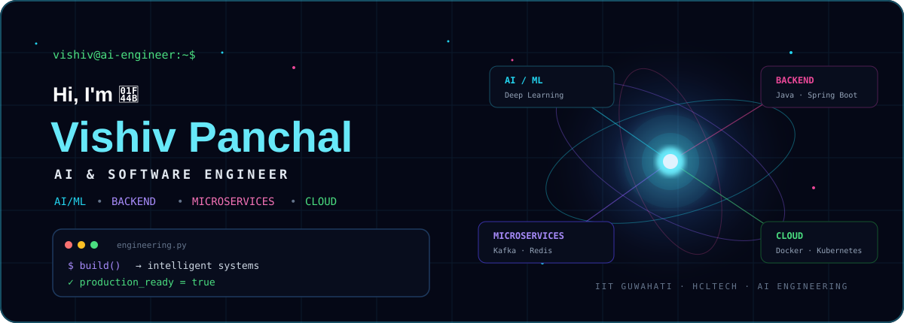
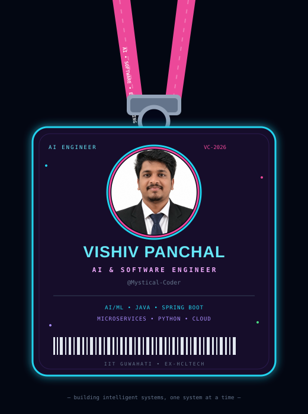
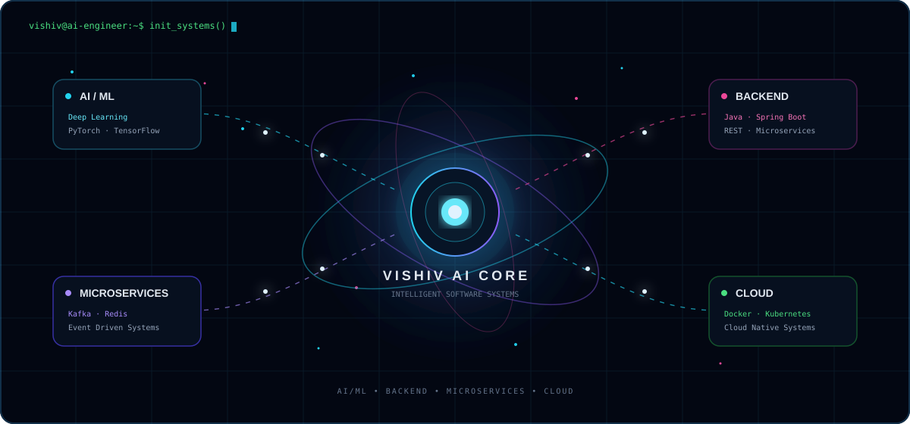

<h1 align="center">Vishiv Panchal</h1>

Software Engineer | AI and GenAI | Backend Engineering

<a href="https://github.com/Mystical-Coder">GitHub</a> •
<a href="mailto:vishiv.panchal@gmail.com">Email</a>

 

<table align="center" border="0">
<tr>

<td width="38%" align="center" valign="middle">

</td>

<td width="62%" valign="middle">

### ⚡ Professional Summary

I am a **Software Engineer with an M.Tech in Robotics and Artificial Intelligence from IIT Guwahati** and **2 years of professional experience at HCL Technologies**. I specialize in building **AI and GenAI applications, RAG systems, machine learning solutions, and scalable Spring Boot microservices**. My experience includes backend engineering, large language model applications, computer vision, natural language processing, and time series machine learning.

• **Education:** M.Tech in **Robotics and Artificial Intelligence** from **IIT Guwahati** and B.Tech in **Computer Science and Engineering** from **GGSIPU**.

• **Professional Experience:** Software Engineer at **HCL Technologies**, working on Spring Boot microservices and REST APIs for **Western Union's enterprise scale international money transfer platform**.

• **Backend Engineering:** Experience with **Java, Spring Boot, Spring Security, REST APIs, Microservices, Apache Kafka, Redis, PostgreSQL, MySQL, MongoDB, and Cassandra**.

• **AI and GenAI:** Experience with **LLMs, Transformers, RAG, Prompt Engineering, Agentic AI, Multi Agent Systems, Tool Calling, MCP, LangGraph, LangChain, PyTorch, and TensorFlow**.

• **AI Applications:** Experience building solutions for **RAG based IT helpdesk automation, OCR based invoice processing, and LSTM based network traffic anomaly detection**.

</td>

</tr>
</table>

 

## 🛠️ Technical Skills

### Programming Languages

`Python` `Java` `SQL` `JavaScript` `TypeScript`

### AI and Machine Learning

`LLMs` `Transformers` `RAG` `Prompt Engineering` `Agentic AI` `Multi Agent Systems` `Tool Calling` `MCP` `Agent Skills` `LangGraph` `LangChain` `PyTorch` `TensorFlow` `Scikit learn` `NLP` `MLflow`

### Backend Development

`Spring Boot` `Spring Security` `Spring MVC` `Spring Data JPA` `FastAPI` `RESTful APIs` `Microservices` `Apache Kafka`

### Databases and Vector Search

`PostgreSQL` `MySQL` `MongoDB` `Cassandra` `Redis` `FAISS` `Pinecone`

### Frontend Development

`React.js` `Tailwind CSS` `HTML` `CSS`

### Cloud and DevOps

`Docker` `Kubernetes` `CI/CD` `Prometheus` `Grafana` `Splunk`

### AI Platforms and Tools

`Azure OpenAI` `OpenRouter` `Git` `GitHub` `Maven` `Gradle` `Jenkins` `Postman` `Swagger`

 

 

## 🎓 Education

### Indian Institute of Technology Guwahati

**M.Tech in Robotics and Artificial Intelligence**

2024 to 2026 | CGPA 7.33

### Guru Gobind Singh Indraprastha University

**B.Tech in Computer Science and Engineering**

2019 to 2022 | CGPA 9.15

 

## 💼 Professional Experience

### Software Engineer | HCL Technologies

**September 2022 to August 2024 | Noida, Uttar Pradesh**

Engineered and maintained **Spring Boot microservices and RESTful APIs** for Western Union's enterprise scale international money transfer platform, applying SOLID principles and design patterns to improve backend scalability, maintainability, and service performance.

Improved API performance using **Redis caching** and **Cassandra data model optimization**, reducing average response time by approximately **30 percent** and improving the performance of high throughput backend services.

Developed an **OCR pipeline for invoice processing** using PaddleOCR and OpenCV with adaptive thresholding, noise removal, and layout detection, achieving **97 percent accuracy compared with 74 percent using Tesseract**.

Built a **RAG system** using Azure OpenAI, GPT 3.5, LangChain, and Pinecone for IT helpdesk automation, improving grounded answer accuracy from **78 percent to 90 percent across 500 plus validated queries**.

Developed an **LSTM based anomaly detection model** using PyTorch and TensorFlow for network traffic monitoring, achieving **91 percent detection accuracy** and reducing false positives by **28 percent** through time series feature engineering and dynamic threshold tuning.

 

## 🏆 Certifications

### Oracle Certified Java Foundations Associate

Oracle certification covering Java fundamentals and core programming concepts.

### Oracle Certified Foundations Associate: Agentic AI

Oracle certification covering foundational concepts in Agentic AI.

 

